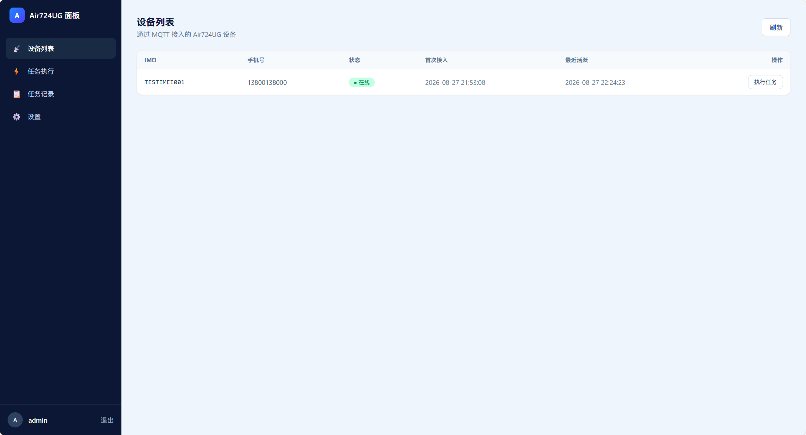
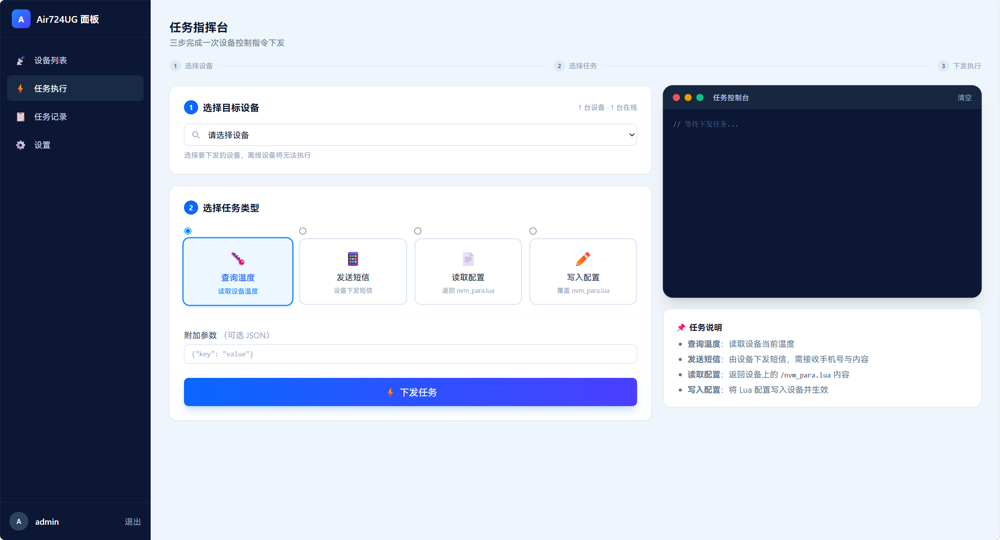
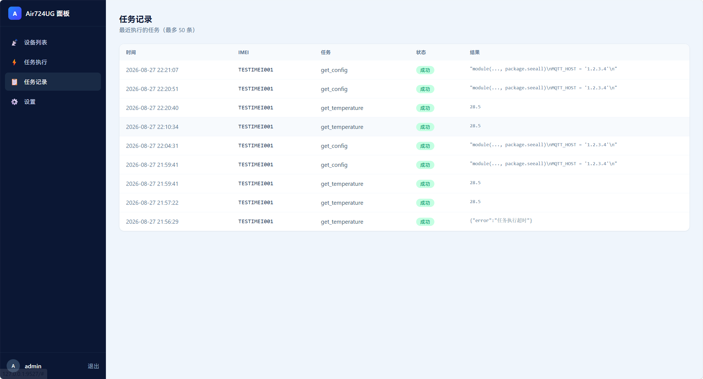

# Air724UG Web Panel

基于合宙 Air724UG（LuatOS-Air）4G 模组的远程管理面板与短信/通话转发器。

设备端固件基于 [0wQ/air724ug-forwarder](https://github.com/0wQ/air724ug-forwarder) 修改扩展；服务端由 **Go 单二进制**（内置 HTTP 面板 + MQTT Broker），前端使用 **Tailwind CSS** 构建，相比原 WebSocket 方案显著降低设备流量消耗。

> 请勿用于非法用途及盈利。

## 特性

- **设备远程管理**：设备列表、在线状态、一键下发任务（查询温度 / 发送短信 / 读取配置 / 写入配置）
- **MQTT 接入**：Go 服务端内置 MQTT Broker，设备端通过 MQTT 对接，心跳仅 2 字节、间隔 300s，节省流量
- **任务记录**：SQLite 持久化最近 50 条任务执行记录
- **远程配置**：读取 / 写入设备端 `nvm_para.lua` 参数文件，支持动态修改设备配置
- **多通道通知**：设备端支持 gotify / telegram / bark / 钉钉 / 飞书 / 企业微信 / pushover / message-pusher 等通知渠道
- **单二进制部署**：前端静态资源通过 `go:embed` 内嵌进 Go 二进制，支持 Docker 一键部署

## 界面预览

### 设备列表



### 任务执行



### 任务记录



### 设置界面


## 系统架构

```
┌────────────┐   MQTT (1883)   ┌──────────────────────────────┐
│ Air724UG   │ ◄─────────────► │          panel-server         │
│ 设备端Lua  │  cmd/{imei}     │  ┌────────┐  ┌──────────────┐ │
│ 固件 script│  device/{imei}  │  │ MQTT   │  │ HTTP 面板    │ │
└────────────┘                 │  │ Broker │  │ (REST + 前端)│ │
                               │  └────────┘  └──────────────┘ │
                               │       │   SQLite (panel.db)   │
                               └───────┴───────────────────────┘
```

- 设备订阅 `cmd/{imei}` 接收指令，上报 `device/{imei}/online`（上线）与 `device/{imei}/result`（任务结果）
- 面板通过 REST API 下发任务，服务端转 MQTT 推送给设备并等待回报（30 秒超时）

## 目录结构

```
air724ug_web_panel/
├── script/               # 设备端 Lua 固件
│   ├── main.lua          # 入口：初始化、MQTT/Gotify 监听启动
│   ├── config.lua        # 设备端默认配置（通知/MQTT/音量/来电动作等）
│   ├── nvm_para.lua      # 设备端参数文件【参考模板】（可写入配置的示例）
│   ├── lib/              # 底层库（nvm / mqtt / sys 等）
│   ├── utils/            # 功能模块（util_mqtt / util_notify / util_mobile 等）
│   └── handler/          # 事件处理（短信 / 来电 / 电源键菜单）
├── server-go/            # Go 服务端（当前主版本）
│   ├── main.go           # 入口：加载配置、启动 HTTP + MQTT
│   ├── api.go            # REST API 与静态资源（go:embed）
│   ├── broker.go         # MQTT Broker、设备在线管理、任务下发
│   ├── db.go             # SQLite 持久化
│   ├── config.go         # 配置加载/保存
│   ├── config.json       # 服务端配置（账号、端口、MQTT）
│   ├── web/              # 前端源码（Tailwind，源码目录）
│   ├── static/           # 前端构建产物（编译进二进制）
│   ├── build-web.ps1     # 前端构建脚本（Tailwind CLI + 复制到 static）
│   ├── sim_device.py     # 模拟设备脚本（无实体设备时联调用）
│   ├── Dockerfile
│   └── panel-server.exe  # 构建产物
├── docker-compose.yml    # Docker 一键部署
└── core/                 # 设备端底层固件包
```

## 快速开始（Go 服务端）

### 本地运行

前置：Go 1.22+（本项目使用纯 Go 的 `modernc.org/sqlite`，无需 CGO）。

```bash
cd server-go
go build -o panel-server.exe .
./panel-server.exe
```

默认配置：

- HTTP 面板：`http://127.0.0.1:9527`
- MQTT Broker：`0.0.0.0:1883`
- 默认账号：`admin / admin123`（可在面板「设置」中修改用户名/密码，或编辑 `config.json`）

### 前端构建（改动 web/ 后需重新构建）

前端源码在 `server-go/web/`，构建产物在 `server-go/static/`（编译时通过 `go:embed` 内嵌进二进制，改动后需重新 `go build`）。

```powershell
# 依赖 E:\tool\go-sdk\tailwindcss.exe（Tailwind 独立 CLI）
cd server-go
powershell -ExecutionPolicy Bypass -File .\build-web.ps1
go build -o panel-server.exe .
```

### Docker 部署

```bash
docker-compose up -d
```

`docker-compose.yml` 暴露 `9527`（HTTP）与 `1883`（MQTT），SQLite 数据通过卷 `panel-data` 持久化到容器 `/app/data/panel.db`。

## 设备端固件对接

1. 将 `script/` 目录内容按原结构烧录到设备（底层固件见 `core/`）
2. 在 `script/config.lua` 中配置服务端地址：

```lua
-- MQTT 对接 Go 服务端
MQTT_HOST = "你的服务器IP或域名"
MQTT_PORT = 1883
MQTT_KEEPALIVE = 300   -- 心跳间隔，可降低流量
```

3. `main.lua` 检测到 `config.MQTT_HOST` 非空即自动启动 MQTT 连接；同时需配置一个通知渠道（如 gotify）用于接收设备事件。

### 设备端参数文件 nvm_para.lua

设备端掉电保存的实时参数文件（`/nvm_para.lua`，备份 `/nvm_para_bak.lua`），优先级高于 `config.lua`。仓库内 `script/nvm_para.lua` 提供了**全部可写参数的注释示例**，可直接复制到面板「任务执行 → 写入配置」中使用，支持远程配置：

- **通知方式**：`NOTIFY_TYPE` 及 gotify/telegram/bark/钉钉/飞书/企业微信等渠道参数
- **MQTT 参数**：`MQTT_HOST` / `MQTT_PORT` / `MQTT_KEEPALIVE` 等
- 音量、来电动作、短信播报、开机通知、网卡、指示灯、SIM pin、录音上传地址等

> 生效规则：固件用 `nvm.get()` 读取的参数（音量/来电动作/短信播报/开机通知等）写入后**重启持久生效**；用 `config.xxx` 读取的参数（MQTT 地址/通知渠道）写入后**当前运行立即生效**，跨重启持久生效需同步修改 `config.lua`。

## Web 面板功能

- **设备列表**：IMEI / 手机号 / 在线状态 / 接入时间，支持一键跳转执行任务
- **任务执行**：三步向导式指挥台（选择设备 → 选择任务类型 → 下发执行），内置终端风格实时控制台展示执行过程
- **任务类型**：查询温度、发送短信、读取配置（返回 `nvm_para.lua` 内容）、写入配置（覆盖 `nvm_para.lua`）
- **任务记录**：最近 50 条执行记录（成功/失败 + 结果详情）
- **设置**：修改登录用户名 / 密码

## API 一览

| 方法 | 路径 | 说明 | 鉴权 |
| --- | --- | --- | --- |
| POST | `/api/login` | 登录，返回 JWT | 否 |
| POST | `/api/logout` | 退出登录 | 是 |
| POST | `/api/change-user-info` | 修改用户名/密码 | 是 |
| GET | `/api/userPool` | 设备列表 | 是 |
| POST | `/api/executeTask` | 下发任务（`{imei, task, ...}`） | 是 |
| GET | `/api/tasks` | 任务记录（最近 50 条） | 是 |
| GET | `/api/health` | 健康检查 | 否 |

## 服务端配置（config.json）

```json
{
  "jwtSecret": "会话签名密钥",
  "user": { "username": "登录用户名", "password": "bcrypt 密文" },
  "tokenVersion": 1,
  "port": 9527,
  "mqtt": { "host": "0.0.0.0", "port": 1883 },
  "dbPath": "panel.db"
}
```

## 模拟设备联调（无实体设备）

`server-go/sim_device.py` 模拟一台通过 MQTT 接入的设备，便于在没有 Air724UG 硬件时验证面板全流程。

```bash
cd server-go
python sim_device.py
```

## 免责声明

本项目仅供学习与技术研究，请勿用于非法用途及盈利。
